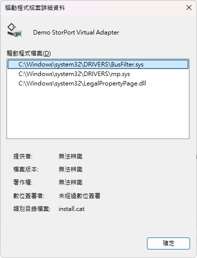
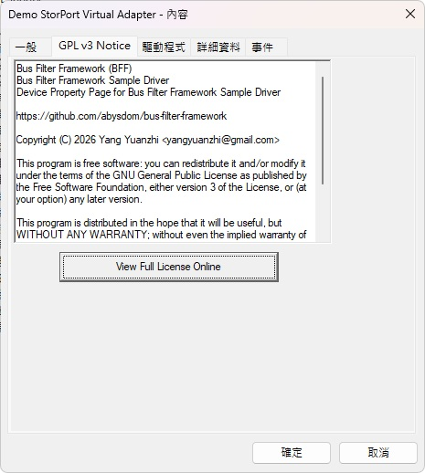
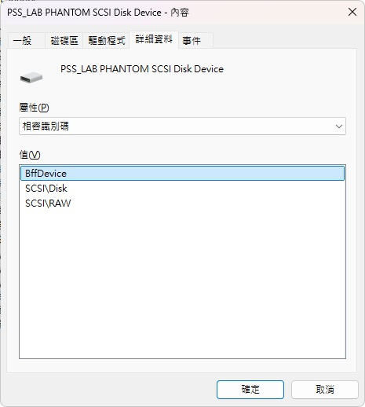

# Bus Filter Framework
A framework for Windows KMDF-based upper filter drivers to behave as bus filters. You don't need to write WDM drivers any more!
# Sample Driver
Check the code in the BusFilter directory as well as ReadMe.htm in the WDKStorPortVirtualMiniport directory. To build the sample driver, open mp\mp.sln with Visual Studio Community Edition.

\

## Alternative to Installation
1. bcdedit /set testsigning on
2. reboot
3. devgen /add /bus ROOT /hardwareid root\mp
4. pnputil /add-driver install.inf /install
## Alternative to Uninstallation
1. pnputil /remove-device /deviceid root\mp
2. pnputil /delete-driver oemXX.inf
## Screenshots
1. Driver Details\

2. GPL v3 Notice\

3. Compatible IDs\

# Documentation
Please navigate to [here](https://bus-filter-framework.blogspot.tw/p/documentation.html).
# FAQ
Please navigate to [here](https://bus-filter-framework.blogspot.tw/p/faq.html).
# Open-Source Project Inspired by BFF
* [DmfBusFilterExtension](https://git.nefarius.at/nefarius/DmfBusFilterExtension) by nefarius
# Donations
If this piece of work eases your pains and you would like to encourage the author, [donations](https://bus-filter-framework.blogspot.com/p/donation.html) are welcome and appreciated!
# License
If you need a software license other than GNU GPL v3, please contact the author.
# More Questions?

