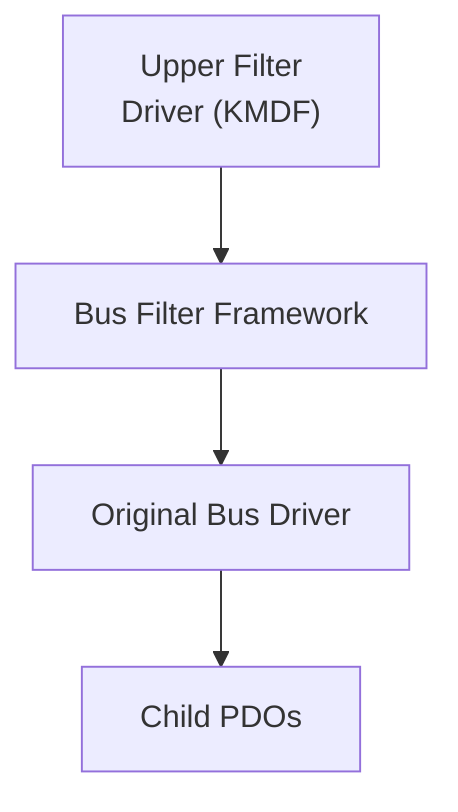
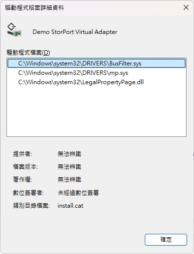
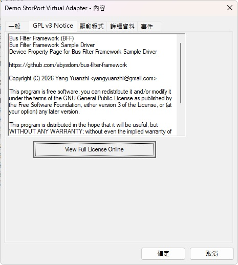
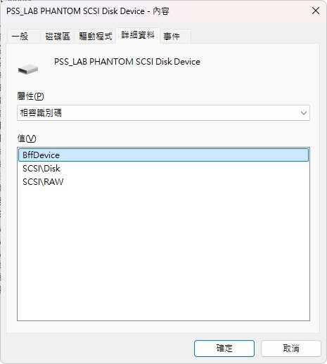

# Bus Filter Framework
<p align="center">
  
</p>

Bus Filter Framework (BFF) is an open-source framework that enables Windows Kernel-Mode Driver Framework (KMDF) upper filter drivers to behave as Bus Filter Drivers without requiring developers to implement a full Windows Driver Model (WDM) bus driver.

BFF bridges the gap between KMDF and WDM by providing a reusable infrastructure for Plug and Play (PnP) bus filtering while allowing driver developers to remain within the KMDF programming model. Instead of spending time implementing WDM boilerplate code, developers can focus on device-specific functionality.

[](https://github.com/abysdom/bus-filter-framework/actions/workflows/codeql.yml)
[](https://github.com/abysdom/bus-filter-framework/actions/workflows/msbuild.yml)
[](LICENSE)

---

# Why Bus Filter Framework?

The Windows Kernel-Mode Driver Framework (KMDF) significantly simplifies Windows driver development. However, KMDF does **not** provide a framework for implementing Bus Filter Drivers.

Developers who need to:

- intercept Plug and Play (PnP) requests,
- enumerate or modify child PDOs,
- customize Compatible IDs or Hardware IDs,
- create virtual devices,
- filter storage, USB, PCI, or other bus devices,

typically have to fall back to Windows Driver Model (WDM), resulting in a considerable amount of infrastructure code unrelated to their actual device logic.

Bus Filter Framework fills this gap by providing a reusable KMDF-based framework that allows developers to implement Bus Filter Drivers without writing WDM infrastructure from scratch.

---

# Features

- KMDF-based Bus Filter Driver framework
- Eliminates most WDM boilerplate code
- Plug and Play (PnP) interception support
- Child PDO management
- Compatible ID / Hardware ID customization
- Virtual device support
- Sample driver included
- Visual Studio 2022 support
- WDK NuGet package support
- GitHub Actions continuous integration

---

# Architecture


```mermaid
flowchart TD
    UFD["Upper Filter\nDriver (KMDF)"]
    BFF["Bus Filter Framework"]
    OBD["Original Bus Driver"]
    CPDO["Child PDOs"]

    UFD --> BFF --> OBD --> CPDO
```

Bus Filter Framework abstracts the WDM infrastructure required for bus filtering while exposing a KMDF programming model to driver developers.

---

# Repository Layout

| Folder | Description |
|---|---|
| .github/workflows/ |          GitHub Actions files |
| BusFilter/ |                  Sample Bus Filter Driver |
| LegalPropertyPage/ |          GPL v3 Notice DLL for Windows Device Manager |
| WDKStorPortVirtualMiniport/ | Git submodule serving as the original bus driver |
| bff/ |                        Bus Filter Framework static library |
| install/ |                    Driver package project |
| mp/ |                         Visual Studio solution |
| screenshots/ |                Screenshots |

---

# Building

## Requirements

- Visual Studio 2022
- Windows Driver Kit (WDK) 10.0.26100 or later
- NuGet package restore enabled

The project uses the WDK NuGet packages introduced in WDK 26100.

To build the project:

```
Open:

    mp\mp.sln
```

or

```
msbuild mp\mp.sln
```

Continuous Integration is automatically performed by GitHub Actions using Windows Server 2022.

---

# Installing the Sample Driver

To install the sample driver, please follow the instructions in the `Installing` section of `ReadMe.htm` under `WDKStorPortVirtualMiniport`.

An alternative installation procedure is shown below.

```
1. bcdedit /set testsigning on

2. reboot

3. devgen /add /bus ROOT /hardwareid root\mp

4. pnputil /add-driver install.inf /install
```

---

# Uninstalling the Sample Driver

To uninstall the sample driver, please follow the instructions in the `Uninstalling` section of `ReadMe.htm` under `WDKStorPortVirtualMiniport`.

An alternative uninstallation procedure is shown below.

```
1. pnputil /remove-device /deviceid root\mp

2. pnputil /delete-driver oemXX.inf
```

---

# Screenshots

## Driver Details



## GPL v3 Notice



## Compatible IDs



---

# Documentation

Additional documentation is available at:

- [Documentation](https://bus-filter-framework.blogspot.tw/p/documentation.html)

- [Frequently Asked Questions](https://bus-filter-framework.blogspot.tw/p/faq.html)

---

# Related Projects

Projects inspired by Bus Filter Framework:

- [DmfBusFilterExtension](https://git.nefarius.at/nefarius/DmfBusFilterExtension) by nefarius

---

# Contributing

Contributions are welcome.

Please submit Pull Requests through GitHub.

By submitting a contribution, you agree to the project's Contributor License Agreement (CLA). The CLA allows contributors to retain copyright ownership while granting the project maintainer the rights necessary to distribute the project under both open-source and commercial licenses.

Please ensure that:

- your code follows the existing coding style;
- your changes are well documented;
- your changes build successfully using the supported WDK.

---

# Licensing

Bus Filter Framework Community Edition is licensed under the GNU General Public License version 3 (GPL v3).

A commercial license is also available for organizations wishing to:

- incorporate Bus Filter Framework into proprietary software;
- distribute closed-source Windows drivers;
- receive commercial technical support;
- obtain customized development services.

Please contact the project maintainer for commercial licensing information.

---

# Donations

If Bus Filter Framework helps your project and you would like to support its continued development, [donations](https://bus-filter-framework.blogspot.com/p/donation.html) are greatly appreciated.

---

# Questions

For additional questions, discussions, or technical exploration, please visit:

[](https://deepwiki.com/abysdom/bus-filter-framework)
