# Bus Filter Framework

<p align="center">
  
</p>

<p align="center">
  <strong>A KMDF-based framework for building Windows Bus Filter Drivers.</strong>
</p>

Bus Filter Framework (BFF) is an open-source framework for developing Windows Kernel-Mode Driver Framework (KMDF) Bus Filter Drivers.

BFF provides reusable infrastructure for filtering bus-enumerated child devices before their function drivers are loaded, while also handling the low-level Plug and Play (PnP) and device-stack operations required to implement a Bus Filter Driver.

The goal of BFF is **not to replace KMDF or the underlying bus driver**. Instead, BFF bridges the gap between the KMDF programming model and the low-level PnP and device-stack infrastructure required by Bus Filter Drivers.

[](https://github.com/abysdom/bus-filter-framework/actions/workflows/codeql.yml)
[](https://github.com/abysdom/bus-filter-framework/actions/workflows/msbuild.yml)
[](LICENSE)

---

## Table of Contents

* [Understanding Bus Filtering](#understanding-bus-filtering)

  * [Bus Filter Driver = Bus Upper Filter + Child-Device Filtering](#bus-filter-driver--bus-upper-filter--child-device-filtering)
  * [Why Is It Called a "Bus Filter"?](#why-is-it-called-a-bus-filter)
  * [Two Related Device-Stack Levels](#two-related-device-stack-levels)

    * [1. Bus Device Stack](#1-bus-device-stack)
    * [2. Child Device Stacks](#2-child-device-stacks)
* [Bus Filter vs. Function Filter](#bus-filter-vs-function-filter)

  * [Function Filter](#function-filter)
  * [Bus Filter](#bus-filter)
* [What Does a Bus Filter Actually Filter?](#what-does-a-bus-filter-actually-filter)
* [Bus Relations](#bus-relations)
* [Device Identity Filtering](#device-identity-filtering)
* [Child-Device Management](#child-device-management)
* [What Is Bus Filter Framework?](#what-is-bus-filter-framework)
* [BFF's Role in the Device Stack](#bffs-role-in-the-device-stack)
* [Why Bus Filter Framework?](#why-bus-filter-framework)
* [Key Benefits](#key-benefits)
* [BFFDEVICE](#bffdevice)
* [Quick Start](#quick-start)
* [Sample Driver](#sample-driver)
* [Sample Architecture](#sample-architecture)
* [Repository Layout](#repository-layout)
* [Building](#building)

  * [Requirements](#requirements)
  * [Clone the Repository](#clone-the-repository)
  * [Build with Visual Studio](#build-with-visual-studio)
  * [Build from the Command Line](#build-from-the-command-line)
* [Installing the Sample Driver](#installing-the-sample-driver)
* [Uninstalling the Sample Driver](#uninstalling-the-sample-driver)
* [Compatibility](#compatibility)
* [What BFF Is Not](#what-bff-is-not)
* [BFF and DmfBusFilterExtension](#bff-and-dmfbusfilterextension)
* [Documentation](#documentation)
* [Testing](#testing)
* [Contributing](#contributing)
* [Licensing](#licensing)
* [Screenshots](#screenshots)

  * [Driver Details](#driver-details)
  * [GPL v3 Notice](#gpl-v3-notice)
  * [Compatible IDs](#compatible-ids)
* [Community and Support](#community-and-support)
* [Donations](#donations)

---

# Understanding Bus Filtering

Before introducing BFF itself, it is useful to understand what a **Bus Filter Driver** is, where it sits in the Windows device stack, and why it is called a *Bus Filter*.

## Bus Filter Driver = Bus Upper Filter + Child-Device Filtering

In Windows driver terminology, a Bus Filter Driver is an **upper filter driver attached to a bus device stack**.

However, being an upper filter of a bus device is not, by itself, sufficient to define a Bus Filter.

The two terms describe different aspects of the driver:

* **Upper Filter** describes the driver's initial position in the bus device stack.
* **Bus Filter** describes its role: filtering the child devices enumerated by the bus.

A simplified bus device stack looks like this:

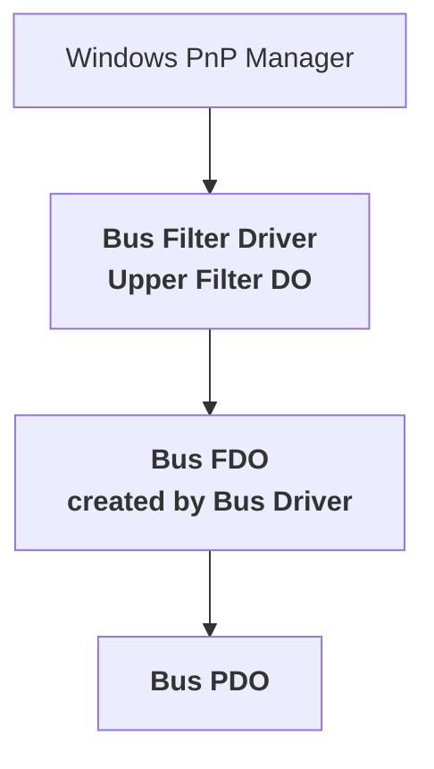
```mermaid
flowchart TB
    PNP["Windows PnP Manager"]

    FILTER["Bus Filter Driver<br/>Upper Filter DO"]
    FDO["Bus FDO<br/>created by Bus Driver"]
    PDO["Bus PDO"]

    PNP --> FILTER
    FILTER --> FDO
    FDO --> PDO

    style FILTER font-weight:bold
    style FDO font-weight:bold
    style PDO font-weight:bold
```

The Bus Filter Driver is therefore initially attached above the bus driver's FDO.

But the defining operation of a Bus Filter happens when the bus enumerates its child devices.

---

## Why Is It Called a "Bus Filter"?

A bus driver is responsible for enumerating child devices and returning the corresponding child PDOs.

For example:

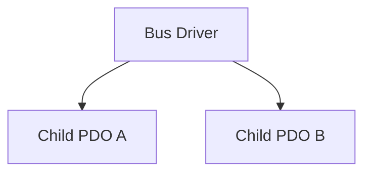
```mermaid
flowchart TD
    BUS["Bus Driver"]

    A["Child PDO A"]
    B["Child PDO B"]

    BUS --> A
    BUS --> B
```

The Bus Filter observes these child devices during bus enumeration.

Before the function driver for a child device is loaded, the Bus Filter creates and attaches a filter device object to the child device stack:

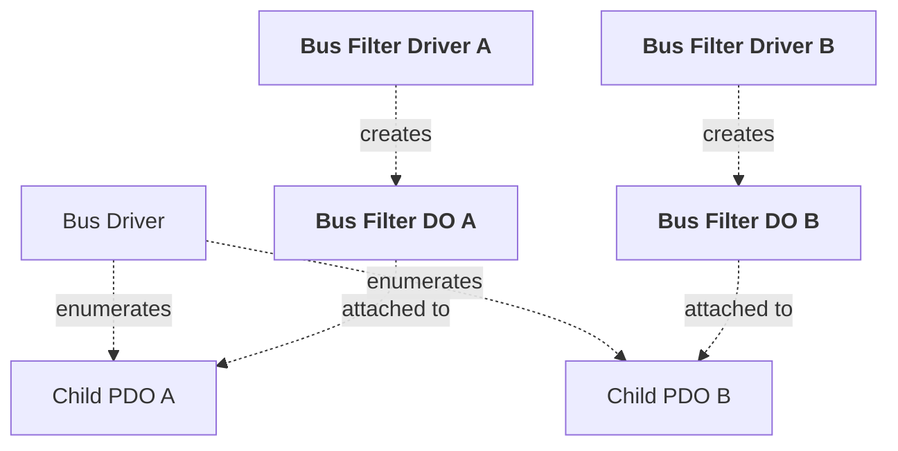
```mermaid
flowchart TB
    BUS["Bus Driver"]

    CHILD1["Child PDO A"]
    CHILD2["Child PDO B"]

    FILTER1["Bus Filter DO A"]
    FILTER2["Bus Filter DO B"]

    BFD1["Bus Filter Driver A"]
    BFD2["Bus Filter Driver B"]

    BUS -. "enumerates" .-> CHILD1
    BUS -. "enumerates" .-> CHILD2

    BFD1 -. "creates" .-> FILTER1
    FILTER1 -. "attached to" .-> CHILD1

    BFD2 -. "creates" .-> FILTER2
    FILTER2 -. "attached to" .-> CHILD2

    style BFD1 font-weight:bold
    style BFD2 font-weight:bold
    style FILTER1 font-weight:bold
    style FILTER2 font-weight:bold
```

This is the essential Bus Filter model:

> **The Bus Filter filters the child devices of a bus by inserting filter device objects into their device stacks before their function drivers are loaded.**

This is the reason the driver is called a **Bus Filter**.

The Bus Filter is associated with the bus because the bus is the source of the child devices being filtered.

---

## Two Related Device-Stack Levels

A Bus Filter therefore operates across two related levels of the device hierarchy.

### 1. Bus Device Stack

The Bus Filter is initially an upper filter of the bus device:

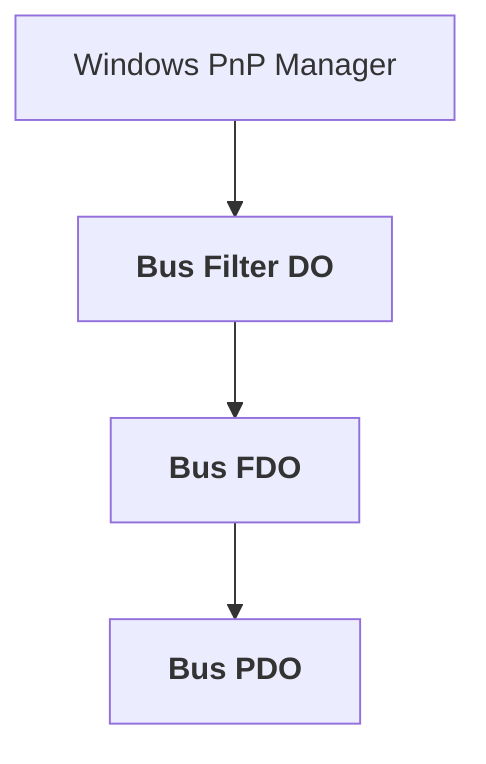
```mermaid
flowchart TB
    PNP["Windows PnP Manager"]

    BF["Bus Filter DO"]
    FDO["Bus FDO"]
    PDO["Bus PDO"]

    PNP --> BF
    BF --> FDO
    FDO --> PDO

    style BF font-weight:bold
    style FDO font-weight:bold
    style PDO font-weight:bold
```

### 2. Child Device Stacks

The same Bus Filter driver then creates filter device objects for the child devices enumerated by the bus:

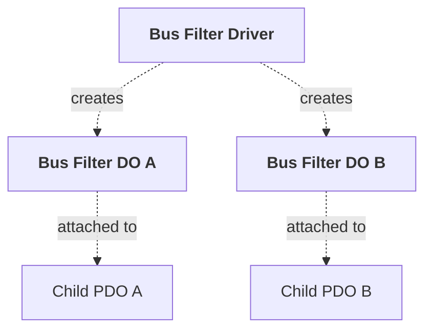
```mermaid
flowchart TB
    BFD["Bus Filter Driver"]
    FILTER1["Bus Filter DO A"]
    PDO1["Child PDO A"]

    FILTER2["Bus Filter DO B"]
    PDO2["Child PDO B"]

    BFD -. "creates" .-> FILTER1
    FILTER1 -. "attached to" .-> PDO1

    BFD -. "creates" .-> FILTER2
    FILTER2 -. "attached to" .-> PDO2

    style BFD font-weight:bold
    style FILTER1 font-weight:bold
    style FILTER2 font-weight:bold
```

This distinction is fundamental to understanding a Bus Filter Driver.

The Bus Filter is not merely a filter for I/O traveling through the bus device.

It is a mechanism for **filtering the child devices produced by the bus**.

---

# Bus Filter vs. Function Filter

Bus Filters and Function Filters are both Windows filter drivers, but they solve different problems.

## Function Filter

A conventional Function Filter (either upper or lower) operates on a particular function device.

It may filter:

* `IRP_MJ_CREATE`
* `IRP_MJ_READ`
* `IRP_MJ_WRITE`
* `IRP_MJ_DEVICE_CONTROL`
* selected PnP operations
* power-management operations

The conceptual question is:

> **"What should happen to requests directed at this function device?"**

---

## Bus Filter

A Bus Filter starts as an upper filter at the bus device stack, and then participates in the enumeration of child devices.

The critical difference is therefore:

|                                 | Function Filter                 | Bus Filter                                     |
| ------------------------------- | ------------------------------- | ---------------------------------------------- |
| **Primary target**              | A function device               | Child devices enumerated by a bus              |
| **Initial attachment**          | Function device stack           | **Bus device stack**                           |
| **Typical role**                | Upper or lower filter           | **Bus upper filter**                           |
| **Child PDO filtering**         | Normally not its defining role  | **Defining role**                              |
| **When child filtering occurs** | N/A                             | **Before the child function driver is loaded** |
| **Bus Relations**               | Usually not the primary concern | Important                                      |
| **Hardware / Compatible IDs**   | May be involved                 | Common scenario                                |
| **Child-device management**     | Usually not its responsibility  | Core capability                                |
| **Virtual child devices**       | Not normally its purpose        | Can be supported                               |

The distinction can be summarized as:

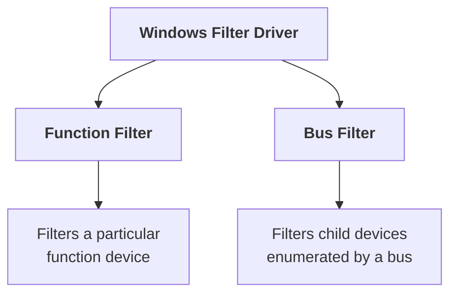
```mermaid
flowchart TB
    FILTER["Windows Filter Driver"]

    FUNCTION["Function Filter"]
    BUS["Bus Filter"]

    FROLE["Filters a particular<br/>function device"]
    BROLE["Filters child devices<br/>enumerated by a bus"]

    FILTER --> FUNCTION
    FILTER --> BUS

    FUNCTION --> FROLE
    BUS --> BROLE

    style FILTER font-weight:bold
    style FUNCTION font-weight:bold
    style BUS font-weight:bold
```

If the requirement is primarily to intercept I/O requests for one known function device, a conventional KMDF Function Filter architecture may be sufficient.

If the requirement is to filter the child devices of a bus **before their function drivers are loaded**, a Bus Filter architecture is appropriate.

---

# What Does a Bus Filter Actually Filter?

The term *Bus Filter* should not be interpreted as meaning that the driver simply filters ordinary I/O traffic going through a bus.

The defining operation is **child-device filtering**.

A bus driver enumerates child devices:

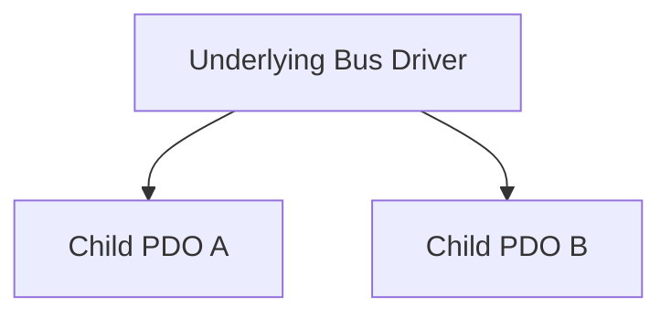
```mermaid
flowchart TD
    BUS["Underlying Bus Driver"]

    A["Child PDO A"]
    B["Child PDO B"]

    BUS --> A
    BUS --> B
```

The Bus Filter intercepts this process and creates filter device objects for the child devices:

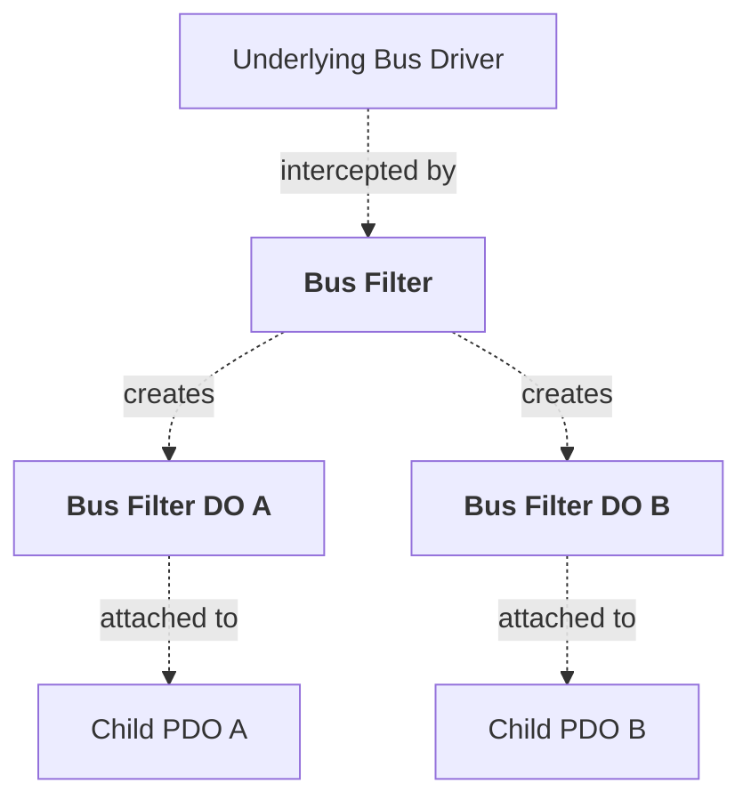
```mermaid
flowchart TD
    BUS["Underlying Bus Driver"]

    FILTER["Bus Filter"]

    A["Child PDO A"]
    B["Child PDO B"]

    FA["Bus Filter DO A"]
    FB["Bus Filter DO B"]

    BUS -. "intercepted by" .-> FILTER

    FILTER -. "creates" .-> FA
    FILTER -. "creates" .-> FB

    FA -. "attached to" .-> A
    FB -. "attached to" .-> B

    style FILTER font-weight:bold
    style FA font-weight:bold
    style FB font-weight:bold
```

The function drivers are subsequently loaded and then create and attach FDOs above those filter device objects:

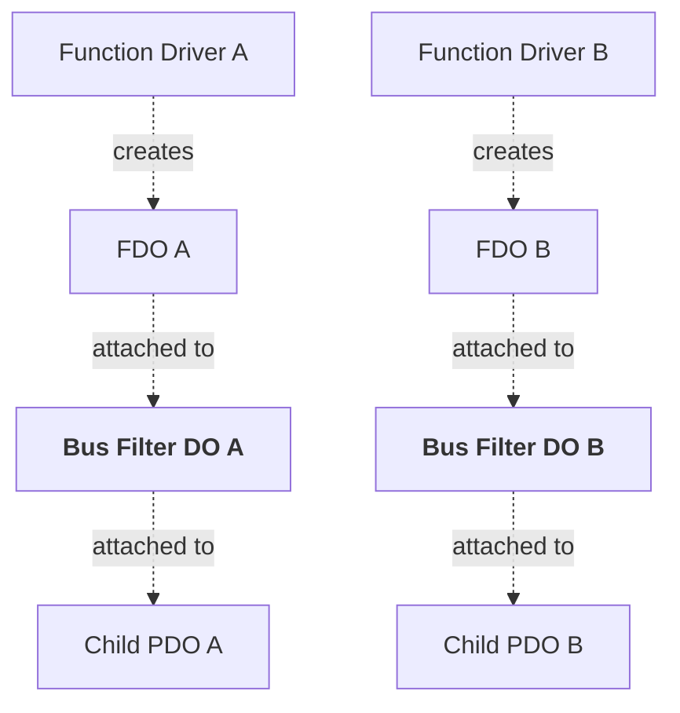
```mermaid
flowchart TB
    FUNC_A["Function Driver A"]
    FDO_A["FDO A"]
    FILTER_A["Bus Filter DO A"]
    PDO_A["Child PDO A"]

    FUNC_B["Function Driver B"]
    FDO_B["FDO B"]
    FILTER_B["Bus Filter DO B"]
    PDO_B["Child PDO B"]

    FUNC_A -. "creates" .-> FDO_A
    FDO_A -. "attached to" .-> FILTER_A
    FILTER_A -. "attached to" .-> PDO_A

    FUNC_B -. "creates" .-> FDO_B
    FDO_B -. "attached to" .-> FILTER_B
    FILTER_B -. "attached to" .-> PDO_B

    style FILTER_A font-weight:bold
    style FILTER_B font-weight:bold
```

This gives the Bus Filter an opportunity to intercept PnP and I/O activity for the child devices before the corresponding function drivers receive control.

---

# Bus Relations

One of the important areas of Bus Filtering is device relations, particularly `BusRelations`.

A simplified flow is:

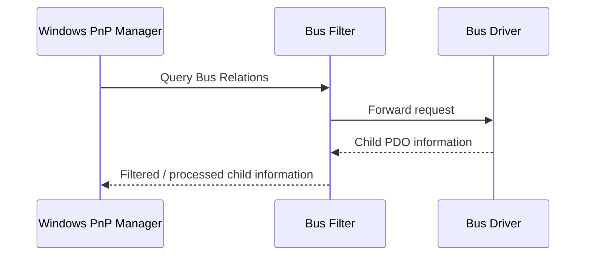
```mermaid
sequenceDiagram
    participant PNP as Windows PnP Manager
    participant BF as Bus Filter
    participant BUS as Bus Driver

    PNP->>BF: Query Bus Relations
    BF->>BUS: Forward request
    BUS-->>BF: Child PDO information
    BF-->>PNP: Filtered / processed child information
```

The underlying bus driver may return a set of child PDOs:

```text
Child PDO A
Child PDO B
Child PDO C
```

The Bus Filter can inspect this information and create or manage filter device objects associated with those child PDOs.

Conceptually:

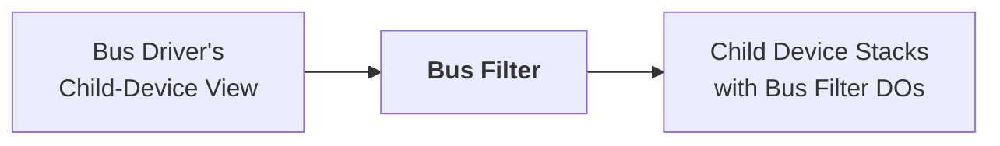
```mermaid
flowchart LR
    ORIGINAL["Bus Driver's<br/>Child-Device View"]

    FILTER["Bus Filter"]

    RESULT["Child Device Stacks<br/>with Bus Filter DOs"]

    ORIGINAL --> FILTER
    FILTER --> RESULT

    style FILTER font-weight:bold
```

The exact behavior depends on the design of the particular Bus Filter Driver.

---

# Device Identity Filtering

Another common Bus Filter scenario is modifying the identity information associated with a child device.

For example, a Bus Filter may customize Compatible IDs:

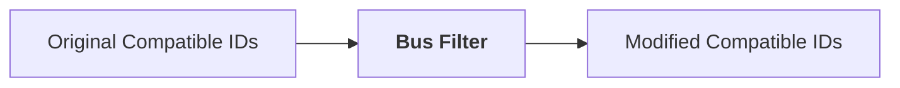
```mermaid
flowchart LR
    ORIGINAL["Original Compatible IDs"]

    FILTER["Bus Filter"]

    RESULT["Modified Compatible IDs"]

    ORIGINAL --> FILTER
    FILTER --> RESULT

    style FILTER font-weight:bold
```

The sample driver included with BFF demonstrates this type of operation by prepending:

```text
BffDevice
```

to the Compatible IDs returned by the underlying bus driver.

This allows the Bus Filter to influence how Windows identifies and matches the child device.

---

# Child-Device Management

Because the Bus Filter creates and manages filter device objects for bus-enumerated child devices, it must also handle the lifecycle of those child-device filter objects.

This includes operations such as:

* detecting newly enumerated child devices;
* creating their filter device objects;
* attaching those objects to the child device stacks;
* maintaining per-child state;
* handling removal;
* handling surprise removal;
* cleaning up framework resources.

This child-device lifecycle management is one of the main areas where reusable Bus Filter infrastructure can substantially reduce driver-specific code.

---

# What Is Bus Filter Framework?

BFF provides reusable infrastructure for implementing Bus Filter Drivers using a KMDF-oriented programming model.

The architecture can be viewed as:

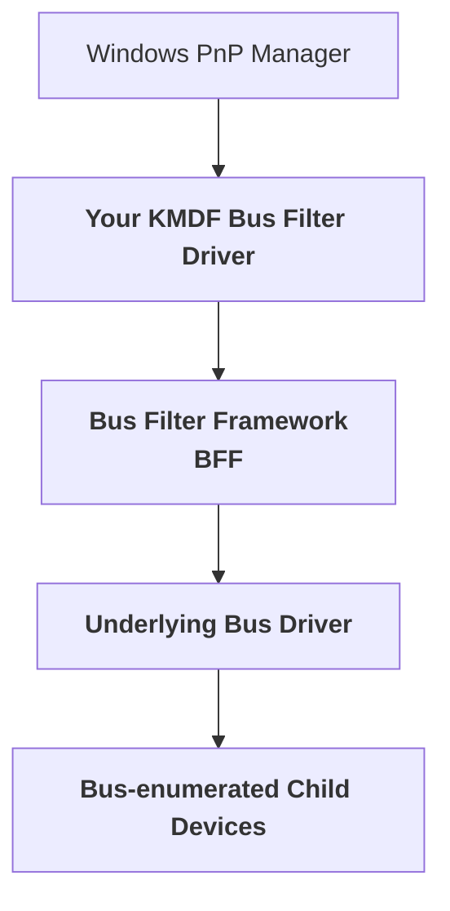
```mermaid
flowchart TB
    PNP["Windows PnP Manager"]

    DRIVER["Your KMDF Bus Filter Driver"]

    BFF["Bus Filter Framework<br/>BFF"]

    BUS["Underlying Bus Driver"]

    CHILD["Bus-enumerated Child Devices"]

    PNP --> DRIVER
    DRIVER --> BFF
    BFF --> BUS
    BUS --> CHILD

    style DRIVER font-weight:bold
    style BFF font-weight:bold
    style BUS font-weight:bold
    style CHILD font-weight:bold
```

BFF provides the infrastructure required for the two related Bus Filter roles:

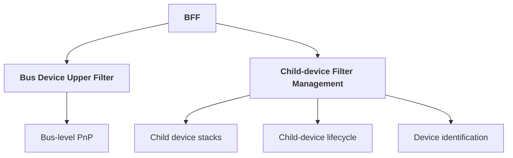
```mermaid
flowchart TB
    BFF["BFF"]

    BUSFILTER["Bus Device Upper Filter"]
    CHILD_FILTER["Child-device Filter Management"]

    BUS_PNP["Bus-level PnP"]
    CHILD_STACK["Child device stacks"]
    LIFECYCLE["Child-device lifecycle"]
    ID["Device identification"]

    BFF --> BUSFILTER
    BFF --> CHILD_FILTER

    BUSFILTER --> BUS_PNP
    CHILD_FILTER --> CHILD_STACK
    CHILD_FILTER --> LIFECYCLE
    CHILD_FILTER --> ID

    style BFF font-weight:bold
    style BUSFILTER font-weight:bold
    style CHILD_FILTER font-weight:bold
```

BFF is intended to handle common Bus Filter infrastructure so that the driver developer can concentrate on the behavior specific to the target bus and child devices.

---

# BFF's Role in the Device Stack

BFF should be viewed as infrastructure used to implement the Bus Filter role.

The Bus Filter driver's initial position is the upper-filter position in the bus device stack:

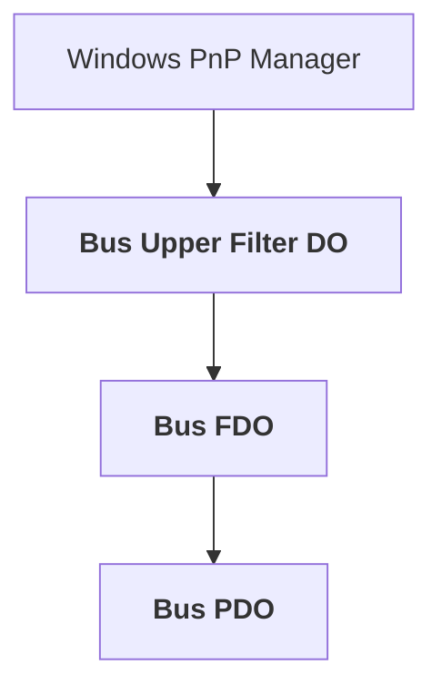
```mermaid
flowchart TB
    PNP["Windows PnP Manager"]

    BF_BUS["Bus Upper Filter DO"]
    BUS_FDO["Bus FDO"]
    BUS_PDO["Bus PDO"]

    PNP --> BF_BUS
    BF_BUS --> BUS_FDO
    BUS_FDO --> BUS_PDO

    style BF_BUS font-weight:bold
    style BUS_FDO font-weight:bold
    style BUS_PDO font-weight:bold
```

On behalf of the Bus Filter driver, BFF then creates filter device objects for the child PDOs enumerated by the bus:

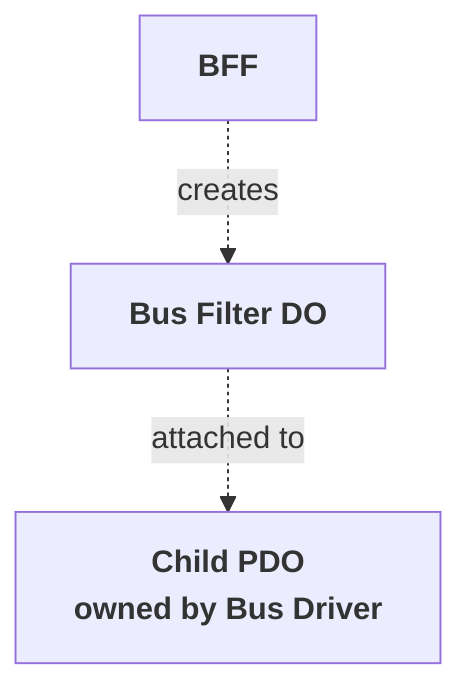
```mermaid
flowchart TB
    BFF["BFF"]

    BF_CHILD["Bus Filter DO"]

    CHILD_PDO["Child PDO<br/>owned by Bus Driver"]

    BFF -. "creates" .-> BF_CHILD
    BF_CHILD -. "attached to" .-> CHILD_PDO

    style BF_CHILD font-weight:bold
    style CHILD_PDO font-weight:bold
    style BFF font-weight:bold
```

Thus, the Bus Filter driver's device objects can exist at both levels:

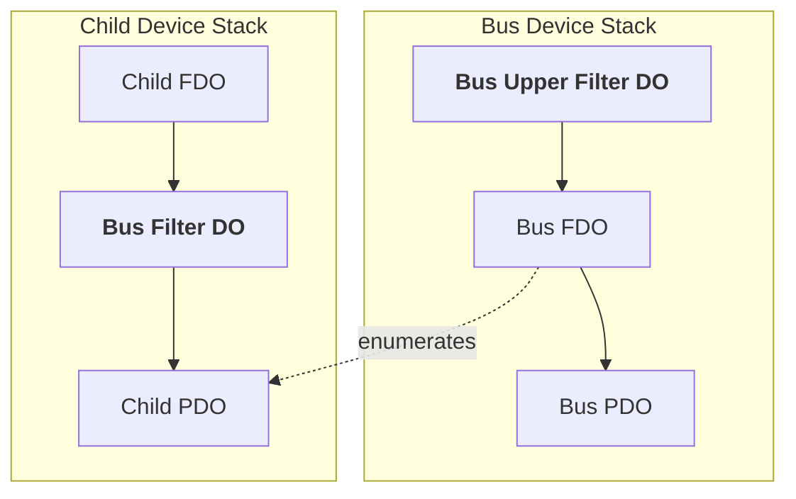
```mermaid
flowchart TB
    subgraph BUS_STACK["Bus Device Stack"]
        direction TB
        BUS_FILTER["Bus Upper Filter DO"]
        BUS_FDO["Bus FDO"]
        BUS_PDO["Bus PDO"]

        BUS_FILTER --> BUS_FDO
        BUS_FDO --> BUS_PDO
    end

    subgraph CHILD_STACK["Child Device Stack"]
        direction TB
        FUNCTION["Child FDO"]
        CHILD_FILTER["Bus Filter DO"]
        CHILD_PDO["Child PDO"]

        FUNCTION --> CHILD_FILTER
        CHILD_FILTER --> CHILD_PDO
    end

    BUS_FDO -. "enumerates" .-> CHILD_PDO

    style BUS_FILTER font-weight:bold
    style CHILD_FILTER font-weight:bold
```

This is the core device-stack model implemented by BFF.

---

# Why Bus Filter Framework?

KMDF significantly simplifies Windows kernel-mode driver development.

However, KMDF has a drawback: It does not support creation of bus filters, *officially*. The only way to create bus filters was to do it in a WDM manner.

Implementing a Bus Filter requires interaction with low-level WDM and PnP infrastructure, including:

* PnP IRPs;
* device relations;
* Bus Relations;
* child PDOs;
* device-stack traversal;
* request forwarding;
* device identification;
* child-device filter creation;
* child-device lifecycle;
* remove locks.

Without reusable infrastructure, a significant portion of the driver can become boilerplate code rather than device-specific code.

Conceptually:

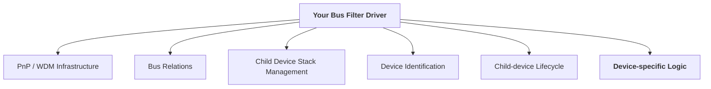
```mermaid
flowchart TD
    DRIVER["Your Bus Filter Driver"]

    DRIVER --> PNP["PnP / WDM Infrastructure"]
    DRIVER --> REL["Bus Relations"]
    DRIVER --> STACK["Child Device Stack Management"]
    DRIVER --> ID["Device Identification"]
    DRIVER --> CHILD["Child-device Lifecycle"]
    DRIVER --> LOGIC["Device-specific Logic"]

    style DRIVER font-weight:bold
    style LOGIC font-weight:bold
```

BFF is intended to move much of the common infrastructure into a reusable framework:

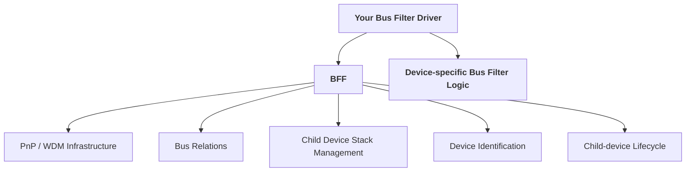
```mermaid
flowchart TD
    DRIVER["Your Bus Filter Driver"]

    BFF["BFF"]

    LOGIC["Device-specific Bus Filter Logic"]

    DRIVER --> BFF
    DRIVER --> LOGIC

    BFF --> PNP["PnP / WDM Infrastructure"]
    BFF --> REL["Bus Relations"]
    BFF --> STACK["Child Device Stack Management"]
    BFF --> ID["Device Identification"]
    BFF --> CHILD["Child-device Lifecycle"]

    style DRIVER font-weight:bold
    style BFF font-weight:bold
    style LOGIC font-weight:bold
```

The result is that the driver developer can spend more of the implementation on **what the Bus Filter is supposed to accomplish**, rather than rebuilding generic Bus Filter infrastructure.

---

# Key Benefits

* **KMDF-based Bus Filter infrastructure**
* Reduce the amount of low-level WDM boilerplate
* Reuse common Bus Filter infrastructure across projects
* Filter bus-enumerated child devices before their function drivers are loaded
* Create and manage child-device filter objects
* Intercept and customize selected PnP operations
* Inspect or modify Bus Relations
* Customize Hardware IDs and Compatible IDs
* Manage child-device state and lifecycle
* Support framework-defined or virtual child devices
* Access the underlying device stack when required
* Integrate Bus Filter functionality into an existing KMDF driver

---

# BFFDEVICE

One of the core concepts in BFF is the **`BFFDEVICE`**.

A `BFFDEVICE` represents a framework-managed Bus Filter device object in a child device stack.

A simplified relationship is:

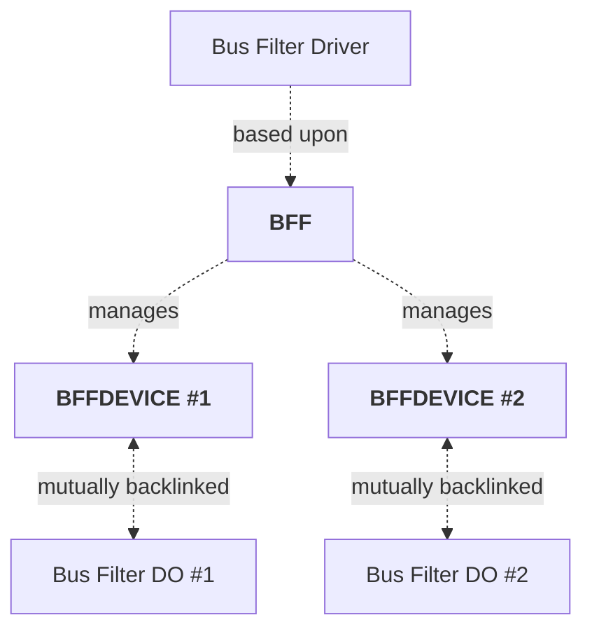
```mermaid
flowchart TD
    DRIVER["Bus Filter Driver"]

    BFF["BFF"]

    BFFDEV1["BFFDEVICE #1"]
    BFFDEV2["BFFDEVICE #2"]

    BFDO1["Bus Filter DO #1"]
    BFDO2["Bus Filter DO #2"]

    DRIVER -. "based upon " .-> BFF

    BFF -. "manages" .-> BFFDEV1
    BFF -. "manages" .-> BFFDEV2

    BFFDEV1 <-. "mutually backlinked" .-> BFDO1
    BFFDEV2 <-. "mutually backlinked" .-> BFDO2

    style BFF font-weight:bold
    style BFFDEV1 font-weight:bold
    style BFFDEV2 font-weight:bold
```

The framework exposes operations for accessing information associated with a BFF device, including:

* the underlying WDM device object;
* the next lower device in the stack;
* the physical device object (PDO);
* remove-lock management.

The exact API details are documented in [`bff/bff.h`](bff/bff.h).

---

# Quick Start

A typical BFF-based driver follows this general initialization sequence:

```mermaid
flowchart LR
    A["Create KMDF Driver"] -->
    B["Configure BFF"] -->
    C["Register Callbacks"] -->
    D["Initialize BFF"] -->
    E["Implement Bus Filter Logic"]

    style A font-weight:bold
    style B font-weight:bold
    style C font-weight:bold
    style D font-weight:bold
    style E font-weight:bold
```

The framework provides APIs including:

```c
BffSetInitializationData(...)
BffInitialize(...)
```

and related APIs for integrating the Bus Filter infrastructure into a KMDF driver.

For example, the sample driver configures BFF during `DriverEntry` and registers handlers for selected PnP operations.

See [`BusFilter/Driver.c`](BusFilter/Driver.c) for a complete implementation.

---

# Sample Driver

The repository contains a complete sample Bus Filter Driver under:

```text
BusFilter/
```

The sample demonstrates how to build a KMDF Bus Filter Driver on top of BFF.

Among other things, the sample demonstrates:

* BFF initialization;
* Bus Filter device creation and removal callbacks;
* child-device filter creation;
* PnP request handling;
* device-interface registration;
* Compatible ID customization;
* interaction with the underlying bus driver;
* KMDF device and queue management.

The sample is intended to serve as the primary starting point for developers who want to understand how BFF is integrated into a real KMDF Bus Filter Driver.

---

# Sample Architecture

The sample driver is designed to work with the repository's `WDKStorPortVirtualMiniport` project.

```mermaid
flowchart TB
    PNP["Windows PnP Manager"]

    FILTER["Sample Bus Filter Driver<br/>Bus Upper Filter"]

    BFF["Bus Filter Framework<br/>BFF"]

    BUS["WDKStorPortVirtualMiniport"]

    CHILD["Bus-enumerated Child PDO"]

    CHILD_FILTER["BFF Child Filter DO"]

    FUNCTION["Function Driver"]

    PNP --> FILTER
    FILTER --> BFF
    BFF --> BUS

    BUS -. "enumerates" .-> CHILD
    BFF -. "creates" .-> CHILD_FILTER
    CHILD_FILTER -. "attached to" .-> CHILD
    FUNCTION -. "forwards IRPs to" .-> CHILD_FILTER

    style FILTER font-weight:bold
    style BFF font-weight:bold
    style CHILD_FILTER font-weight:bold
    style FUNCTION font-weight:bold
```

The individual components have the following roles:

| Component                      | Role                                                          |
| ------------------------------ | ------------------------------------------------------------- |
| **Sample Bus Filter Driver**   | Implements the device-specific Bus Filter logic               |
| **BFF**                        | Provides Bus Filter and child-device filter infrastructure    |
| **WDKStorPortVirtualMiniport** | Provides the underlying virtual bus functionality             |
| **Child PDO**                  | Represents a device enumerated by the bus                     |
| **BFF Child Filter DO**        | Filters the child device before its function driver is loaded |
| **Function Driver**            | Implements the functionality of the child device              |

The sample modifies information associated with the child device while allowing the underlying bus driver to continue handling the actual bus functionality.

The `WDKStorPortVirtualMiniport` project is included as a Git submodule.

---

# Repository Layout

| Path                          | Description                                               |
| ----------------------------- | --------------------------------------------------------- |
| `.github/workflows/`          | GitHub Actions workflows                                  |
| `BusFilter/`                  | Complete sample Bus Filter Driver                         |
| `LegalPropertyPage/`          | GPL v3 notice property-page DLL used by the sample        |
| `WDKStorPortVirtualMiniport/` | Git submodule containing the underlying sample bus driver |
| `bff/`                        | BFF framework implementation and public header            |
| `install/`                    | Driver package project                                    |
| `mp/`                         | Visual Studio solution                                    |
| `screenshots/`                | Screenshots used by the documentation                     |

---

# Building

## Requirements

The current build environment targets:

* Windows 10 or later
* Visual Studio 2022
* Windows Driver Kit (WDK) 10.0.26100 or later
* NuGet package restore

The project uses the WDK NuGet packages introduced with WDK 26100.

## Clone the Repository

Because the sample depends on the `WDKStorPortVirtualMiniport` Git submodule, clone the repository recursively:

```bash
git clone --recurse-submodules https://github.com/abysdom/bus-filter-framework.git
```

If the repository has already been cloned without its submodules:

```bash
git submodule update --init --recursive
```

## Build with Visual Studio

Open:

```text
mp\mp.sln
```

and build the solution.

## Build from the Command Line

For example:

```powershell
msbuild mp\mp.sln
```

NuGet package restore must be available to the build environment.

GitHub Actions continuously builds the project to detect build regressions.

---

# Installing the Sample Driver

The repository includes an installation package for the sample driver.

The sample installation requires a suitable test-signing environment because the sample driver is intended for development and experimentation.

A typical installation sequence is:

```powershell
bcdedit /set testsigning on
```

Reboot Windows after enabling test signing.

Create the sample root-enumerated device:

```powershell
devgen /add /bus ROOT /hardwareid root\mp
```

Then install the driver package:

```powershell
pnputil /add-driver install.inf /install
```

The `install.inf` package is generated by the `install` project.

The `WDKStorPortVirtualMiniport` project also contains installation documentation for the virtual bus device.

---

# Uninstalling the Sample Driver

Remove the root-enumerated device:

```powershell
pnputil /remove-device /deviceid root\mp
```

Then remove the installed driver package:

```powershell
pnputil /delete-driver oemXX.inf
```

Replace `oemXX.inf` with the published OEM INF name assigned by Windows.

For details concerning the underlying virtual miniport device, see the documentation in:

```text
WDKStorPortVirtualMiniport
```

---

# Compatibility

The current project targets:

* Windows kernel-mode driver development
* KMDF
* WDK 10.0.26100 or later
* Visual Studio 2022
* WDK NuGet packages

The sample is intended primarily as a development and learning resource for Windows driver developers.

For production use, verify the supported Windows versions, KMDF version, signing requirements, and deployment requirements for your specific driver project.

---

# What BFF Is Not

BFF does not replace:

* Windows Driver Frameworks (WDF);
* Kernel-Mode Driver Framework (KMDF);
* the Windows Plug and Play manager;
* the underlying bus driver;
* the function drivers of the bus-enumerated child devices.

BFF is an infrastructure layer that complements KMDF by providing functionality needed by Bus Filter Drivers.

BFF also does not attempt to hide all WDM concepts.

Bus Filter Drivers inherently interact with parts of the Windows PnP and device-stack infrastructure that are below the normal KMDF abstraction level.

Instead, BFF aims to minimize the amount of low-level infrastructure that an application-specific Bus Filter Driver needs to implement itself.

---

# BFF and DmfBusFilterExtension

[BFF](https://github.com/abysdom/bus-filter-framework) and [DmfBusFilterExtension](https://git.nefarius.at/nefarius/DmfBusFilterExtension) are both intended to simplify the development of Windows Bus Filter Drivers.

They take different architectural approaches.

|                           | BFF                          | DmfBusFilterExtension                |
| ------------------------- | ---------------------------- | ------------------------------------ |
| KMDF                      | Yes                          | Yes                                  |
| DMF dependency            | No                           | Yes                                  |
| Bus Filter infrastructure | Yes                          | Yes                                  |
| Child-device abstraction  | `BFFDEVICE`                  | `DMFBUSCHILDDEVICE`                  |
| WDM interaction           | Encapsulated where practical | Encapsulated by the extension/DMF    |
| DMF ecosystem             | No                           | Yes                                  |
| Primary focus             | Bus Filter infrastructure    | Bus Filter infrastructure within DMF |

BFF is intentionally focused on the Bus Filter problem and does not require the broader DMF ecosystem.

DmfBusFilterExtension is part of the larger DMF ecosystem and may therefore be a natural choice for projects that already depend on DMF.

The two projects can be evaluated according to the architecture, dependencies, and requirements of the driver being developed.

---

# Documentation

Additional documentation is available at:

* [Documentation](https://bus-filter-framework.blogspot.tw/p/documentation.html)
* [Frequently Asked Questions](https://bus-filter-framework.blogspot.tw/p/faq.html)

The public API is documented in:

```text
bff\bff.h
```

The sample implementation in:

```text
BusFilter\
```

is also an important reference for understanding how the framework is integrated into a KMDF driver.

---

# Testing

BFF is intended to support development of Windows kernel-mode Bus Filter Drivers that can be tested using the normal Windows driver development and validation workflow.

More comprehensive **Windows Hardware Lab Kit (HLK) testing documentation is planned**.

> **HLK documentation is currently a work in progress and is not yet provided as part of this repository.**

Until the HLK documentation is available, developers should perform the appropriate driver validation for their own target hardware, Windows versions, and deployment scenario.

---

# Contributing

Contributions are welcome.

Please submit pull requests through GitHub.

Before contributing, please review:

* [`CONTRIBUTING.md`](CONTRIBUTING.md)
* [`CONTRIBUTOR_LICENSE_AGREEMENT.md`](CONTRIBUTOR_LICENSE_AGREEMENT.md)
* [`CODE_OF_CONDUCT.md`](CODE_OF_CONDUCT.md)

By submitting a contribution, you agree to the project's Contributor License Agreement (CLA).

The CLA allows contributors to retain copyright ownership while granting the project maintainer the rights necessary to distribute the project under open-source and commercial licenses.

Please ensure that:

* your code follows the existing coding style;
* your changes are appropriately documented;
* your changes build successfully using the supported WDK;
* changes to driver behavior include appropriate testing information where applicable.

---

# Licensing

Bus Filter Framework Community Edition is licensed under the GNU General Public License version 3 (GPL v3).

See [`LICENSE`](LICENSE) for the complete license text.

A commercial license is also available for organizations that need to:

* incorporate BFF into proprietary software;
* distribute closed-source Windows drivers;
* obtain commercial technical support;
* obtain customized development services.

Please contact the project maintainer for commercial licensing information.

---

# Screenshots

## Driver Details

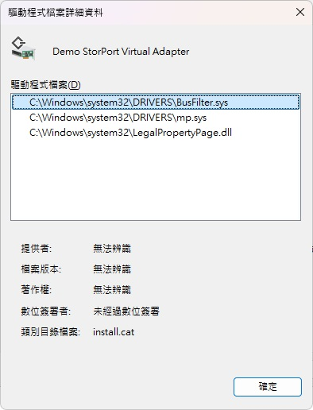

## GPL v3 Notice

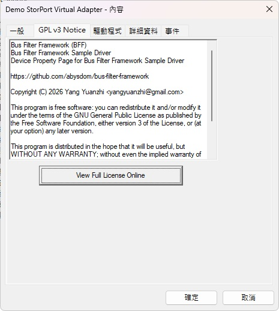

## Compatible IDs

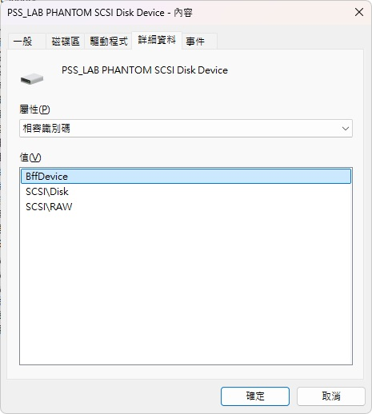

---

# Community and Support

For questions, discussions, bug reports, and feature requests, please use the project's GitHub repository.

You can also explore the project using:

[](https://deepwiki.com/abysdom/bus-filter-framework)

---

# Donations

If Bus Filter Framework helps your project and you would like to support its continued development, [donations](https://bus-filter-framework.blogspot.com/p/donation.html) are greatly appreciated.
